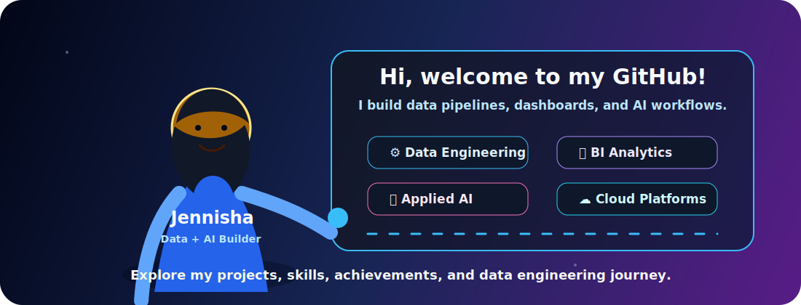

<div align="center">

<!-- Hero -->


<br />
<br />

<a href="https://github.com/jennisha-martin">
  
</a>
<a href="http://www.linkedin.com/in/jennisha-martin">
  
</a>
<a href="mailto:jennishamartin163@gmail.com">
  
</a>


<br />
<br />

### ⚡ Profile Navigation

<a href="#-about-me">About</a> •
<a href="#-superpower-stack">Skills</a> •
<a href="#-featured-projects">Projects</a> •
<a href="#-github-analytics">Analytics</a> •
<a href="#-lets-connect">Connect</a>

<br />
<br />

<!-- Upload this image to Assets/simple-github-guide-girl.svg for it to show -->


</div>

---

## 🦸‍♀️ About Me

I'm **Jennisha Martin**, a **Data Engineer**, **Data Analyst**, and **Applied AI Enthusiast** focused on building reliable data systems that move from raw information to real business impact.

I design efficient **ETL/ELT pipelines**, cloud data platforms, dimensional models, analytics dashboards, and AI-powered workflows. My favorite work lives where **data engineering**, **BI**, **cloud**, and **applied AI** meet.

This profile includes a simple animated guide character that introduces my GitHub, explains what I build, and points visitors toward my projects, skills, and data engineering journey.

```yaml
superpowers:
  - Scalable ETL/ELT pipelines
  - Cloud analytics platforms
  - Data warehousing and dimensional modeling
  - BI dashboards and KPI storytelling
  - MLOps, RAG, LLMs, and agentic AI workflows
mission: "Transform complex datasets into dependable insights and intelligent action."
```

---

## 🔭 Currently Working On

<details open>
  <summary><b>🚀 AI-Powered Analytics Workflows</b></summary>
  <br />
  Building systems that automate insight discovery, KPI monitoring, and decision support across modern data platforms.
</details>

<details open>
  <summary><b>⚙️ MLOps and Production ML Systems</b></summary>
  <br />
  Exploring model monitoring, incident remediation, fairness checks, orchestration, reproducibility, and deployment automation.
</details>

<details>
  <summary><b>🧠 Agentic AI and RAG Systems</b></summary>
  <br />
  Designing retrieval-augmented workflows, LLM-powered assistants, vector search patterns, and tool-using AI systems.
</details>

<details>
  <summary><b>💬 Ask Me About</b></summary>
  <br />
  Data pipelines, Snowflake, AWS, Airflow, Spark, dbt, Power BI, Tableau, Looker Studio, MLOps, NLP, RAG, LLM workflows, dashboards, and analytics strategy.
</details>

---

## 🛠️ Superpower Stack

<div align="center">

### Core Toolkit


<br />
<br />

### Data, Analytics & AI


</div>

<details>
  <summary><b>🧰 Open Full Skill Map</b></summary>
  <br />

| Category | Tools & Focus Areas |
|---|---|
| **Programming** | Python, SQL, Java, Bash, C, C++, JavaScript |
| **Data Engineering** | Airflow, Spark, dbt, AWS Glue, Databricks, Snowflake, Redshift, Data Modeling |
| **Cloud & DevOps** | AWS, Docker, Kubernetes, Terraform, Jenkins, GitHub Actions, CI/CD |
| **BI & Analytics** | Power BI, Tableau, Looker Studio, DAX, KPI Development, Predictive Modeling, A/B Testing |
| **AI / ML** | Scikit-learn, TensorFlow, PyTorch, MLOps, NLP, RAG, LLMs, Feature Engineering, Model Evaluation |

</details>

---

## 🚀 Featured Projects

<details open>
  <summary><b>🤖 AutoMend — Autonomous MLOps Remediation Platform</b></summary>
  <br />

Built a self-healing MLOps system that detects, diagnoses, and resolves machine learning incidents automatically.

- 🥉 Secured **3rd Place at Google Boston**
- ⚡ Reduced incident response time by **40%**
- 🧠 Integrated Airflow, Ray, DVC, Fairlearn, BERT, and Llama-3
- **Tech Stack:** `Python` `Airflow` `Ray` `Polars` `Docker` `DVC` `BERT` `Llama-3`

</details>

<details open>
  <summary><b>📦 SupplyFlow — Supply Chain Analytics Platform</b></summary>
  <br />

Designed an end-to-end AWS data platform for logistics and profitability analysis.

- ☁️ Built serverless ETL pipelines using AWS services
- 🏗️ Developed a snowflake-schema warehouse for analytics
- 📊 Delivered executive dashboards for profitability and carrier performance
- **Tech Stack:** `AWS S3` `Lambda` `Glue` `Redshift` `PySpark` `Power BI`

</details>

<details>
  <summary><b>🏥 HealthSync — Healthcare Data Platform</b></summary>
  <br />

Developed a healthcare analytics pipeline leveraging Medicare claims data.

- 🥈 Implemented medallion architecture in Snowflake
- 🔎 Identified opioid overprescription and duplicate-claim patterns
- 📊 Created operational dashboards for healthcare insights
- **Tech Stack:** `Python` `SQL` `dbt` `Snowflake` `AWS S3` `Looker Studio`

</details>

<details>
  <summary><b>📈 TweetPulse — Real-Time Social Media Analytics</b></summary>
  <br />

Built a streaming analytics platform for Twitter engagement monitoring.

- ⚡ Automated real-time ingestion into Snowflake
- 💬 Implemented sentiment and trend monitoring workflows
- 📊 Developed near real-time business dashboards
- **Tech Stack:** `Python` `Azure Blob Storage` `EventGrid` `Snowpipe` `Snowflake`

</details>

---

## 🏆 Achievements

<div align="center">

| Recognition | Details |
|---|---|
| 🥉 **3rd Place – Google Boston (2026)** | AutoMend: Autonomous MLOps Incident Remediation Platform |
| ⭐ **Infosys Rising Star Award (2023)** | Recognized for high-impact contributions and growth |
| 🏅 **Infosys Insta Award (2022)** | Recognized for strong delivery and performance |

</div>

---

## 📊 GitHub Analytics

<div align="center">


<br />
<br />


</div>

---

## 🧭 My Data Philosophy

```text
Raw Data
  ↓
Reliable Pipelines
  ↓
Analytics-Ready Models
  ↓
Clear Dashboards + ML Signals
  ↓
Smarter Decisions
  ↓
Scalable Impact
```

---

## 📫 Let's Connect

<div align="center">

### ✨ Building data systems with superhero-level reliability.

<br />

<a href="http://www.linkedin.com/in/jennisha-martin">
  
</a>
<a href="mailto:jennishamartin163@gmail.com">
  
</a>

<br />
<br />


</div>
