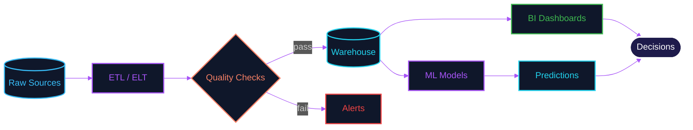
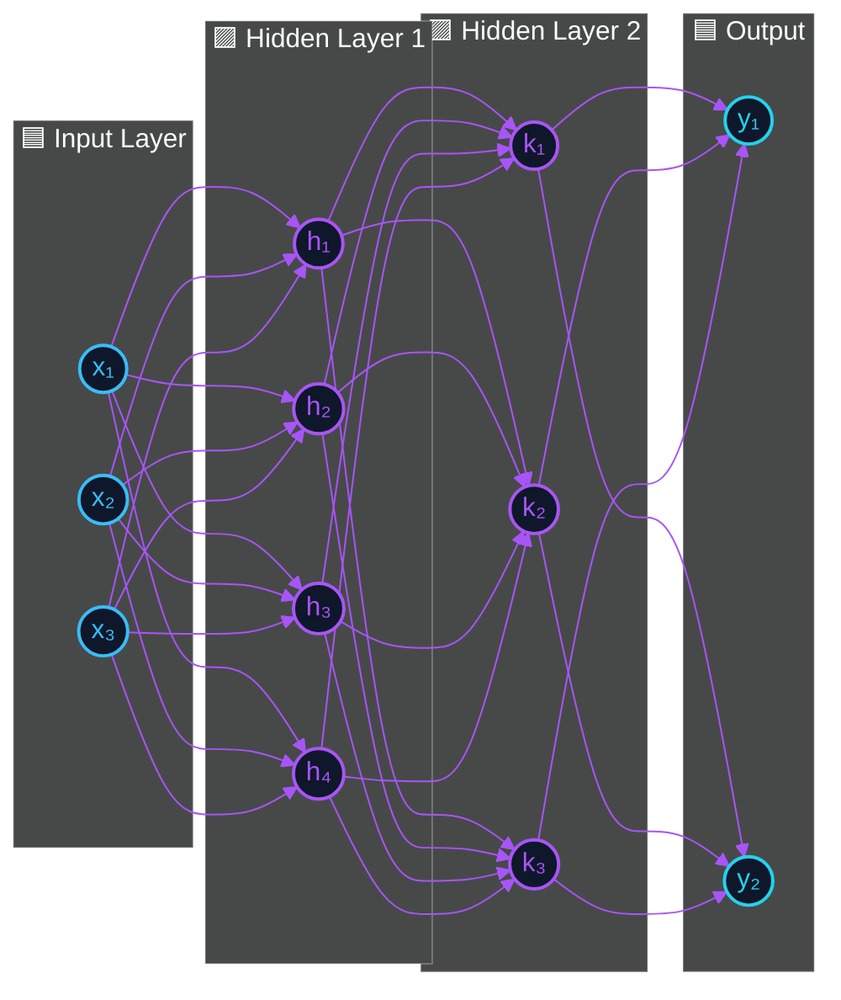
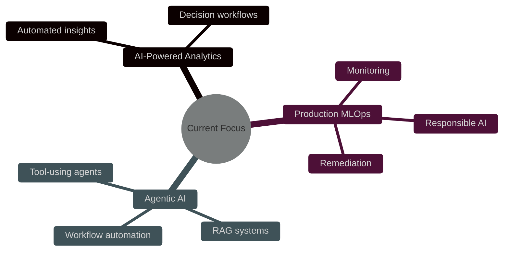

<!--
================================================================
  ✨ Jennisha Martin · GitHub Profile README — SINGLE FILE
  Drop this README.md into a public repo named exactly your
  GitHub username (e.g. jennisha-martin/jennisha-martin) and it
  will display on your profile. Nothing else to upload.
================================================================
-->

<!-- ━━━━━━━━━━━━━━━━━━━━━━━━ HERO ━━━━━━━━━━━━━━━━━━━━━━━━ -->

<p align="center">
  
</p>

<p align="center">
  
</p>

<p align="center">
  <a href="http://www.linkedin.com/in/jennisha-martin"></a>
  <a href="mailto:jennishamartin163@gmail.com"></a>
  <a href="https://github.com/jennisha-martin"></a>
  
</p>

<p align="center"><strong>✦ Interactive Profile Hub ✦</strong></p>

<p align="center">
  <a href="#-hello-im-jennisha"></a>
  <a href="#%EF%B8%8F-what-i-build"></a>
  <a href="#-featured-projects"></a>
  <a href="#tech-stack"></a>
  <a href="#-github-pulse"></a>
  <a href="#-lets-connect"></a>
</p>


<!-- ━━━━━━━━━━━━━━━━━━━━━━━ HELLO ━━━━━━━━━━━━━━━━━━━━━━━ -->

##  Hello, I'm Jennisha

I'm a **Data Engineer**, **Data Analyst**, and **Applied AI Enthusiast** who loves building systems that make data useful, trustworthy, and actionable.

I design efficient **ETL/ELT pipelines**, develop **BI solutions**, and use modern cloud technologies to transform complex datasets into insights that help teams make better decisions.

```yaml
focus:
  - Scalable data pipelines
  - Cloud data platforms
  - Analytics engineering
  - Machine learning workflows
  - MLOps, RAG, and agentic AI systems
mission: "Build dependable data and AI solutions that create meaningful impact."
caffeine_level: dangerously high
```


<!-- ━━━━━━━━━━━━━━━━━━━━ WHAT I BUILD ━━━━━━━━━━━━━━━━━━━━ -->

##  What I Build

<details open>
  <summary><b> &nbsp;Data Pipelines</b></summary>
  <br/>
  Scalable ETL/ELT workflows for high-volume ingestion, transformation, orchestration, monitoring, and quality checks.
</details>

<details open>
  <summary><b> &nbsp;Cloud Data Platforms</b></summary>
  <br/>
  Modern platforms using AWS, Snowflake, Spark, Airflow, Redshift, Databricks, and serverless services.
</details>

<details>
  <summary><b> &nbsp;BI &amp; Analytics Products</b></summary>
  <br/>
  Dashboards, KPI reporting, dimensional models, executive analytics, predictive modeling, and business-ready data layers.
</details>

<details>
  <summary><b> &nbsp;Applied AI Systems</b></summary>
  <br/>
  Machine learning, MLOps, NLP, RAG, LLM workflows, model evaluation, and AI-powered automation for real-world decision systems.
</details>

<br/>

###  How my data pipelines flow




<!-- ━━━━━━━━━━━━━━━━━━━━━━ DRIVE ━━━━━━━━━━━━━━━━━━━━━━━ -->

##  What Drives Me

I enjoy working across the data and AI stack, building solutions that turn ideas into practical outcomes. From reliable pipelines and cloud platforms to analytics products that support business decisions, I focus on systems that are both **scalable** and **useful**.

Over time, my work has expanded into **machine learning**, **MLOps**, **RAG systems**, and **agentic AI applications**. What I enjoy most is connecting the pieces: transforming raw data into insights, automating complex workflows, and building intelligent systems that solve real problems.


<!-- ━━━━━━━━━━━━━━━━━━━━ PROJECTS ━━━━━━━━━━━━━━━━━━━━ -->

##  Featured Projects

>  &nbsp;*Click any project to expand details.*

<details>
<summary>&nbsp;&nbsp; <b>AutoMend</b> — <i>Autonomous MLOps Remediation Platform</i> &nbsp;<code>🥉 Google Boston</code></summary>
<br/>

A self-healing MLOps system that **detects, diagnoses, and resolves** machine-learning incidents automatically.

| Highlight | Detail |
|---|---|
|  | **3rd Place** at Google Boston |
|  | **40% reduction** in incident response time |
|  | Integrated **Airflow · Ray · DVC · Fairlearn · BERT · Llama-3** |


</details>

<details>
<summary>&nbsp;&nbsp; <b>SupplyFlow</b> — <i>Supply Chain Analytics Platform on AWS</i></summary>
<br/>

End-to-end AWS data platform for **logistics and profitability** analysis, from raw shipment events to executive dashboards.

| Highlight | Detail |
|---|---|
|  | Built serverless ETL pipelines using AWS services |
|  | Designed snowflake-schema warehouse |
|  | Delivered executive profitability dashboards |


</details>

<details>
<summary>&nbsp;&nbsp; <b>HealthSync</b> — <i>Healthcare Data Platform</i></summary>
<br/>

Healthcare analytics pipeline that processes **Medicare claims** to surface clinical and operational patterns.

| Highlight | Detail |
|---|---|
|  | Implemented medallion architecture in Snowflake |
|  | Detected opioid over-prescription patterns |
|  | Found duplicate-claim patterns |


</details>

<details>
<summary>&nbsp;&nbsp; <b>TweetPulse</b> — <i>Real-Time Social Media Analytics</i></summary>
<br/>

Streaming analytics platform monitoring **Twitter engagement** in near real-time.

| Highlight | Detail |
|---|---|
|  | Automated real-time ingestion into Snowflake |
|  | Sentiment and trend monitoring |
|  | Near real-time business dashboards |


</details>


<!-- ━━━━━━━━━━━━━━━━━━━━ TECH STACK ━━━━━━━━━━━━━━━━━━━━ -->

<a id="tech-stack"></a>

##  Tech Stack

<p align="center">
  
  <br/><br/>
  
  <br/><br/>
  
</p>

<details>
<summary><b> &nbsp;Programming Languages</b></summary>
<br/>


</details>

<details>
<summary><b> &nbsp;Data Engineering</b></summary>
<br/>


</details>

<details>
<summary><b> &nbsp;Cloud &amp; DevOps</b></summary>
<br/>


</details>

<details>
<summary><b> &nbsp;BI &amp; Analytics</b></summary>
<br/>


</details>

<details>
<summary><b> &nbsp;AI / ML</b></summary>
<br/>


</details>

<br/>

###  Inside an AI model I'd build




<!-- ━━━━━━━━━━━━━━━━━━━ ACHIEVEMENTS ━━━━━━━━━━━━━━━━━━━ -->

##  Achievements

<div align="center">

| Recognition | Details | Year |
|:---:|:---|:---:|
|  | **3rd Place — Google Boston** · *AutoMend: Autonomous MLOps Incident Remediation Platform* | 2026 |
|  | **Infosys Rising Star Award** · Recognized for high-impact contributions and growth | 2023 |
|  | **Infosys Insta Award** · Recognized for strong delivery and performance | 2022 |

</div>


<!-- ━━━━━━━━━━━━━ CURRENTLY EXPLORING ━━━━━━━━━━━━━ -->

##  Currently Exploring

<p align="center">
  
</p>




<!-- ━━━━━━━━━━━━━━━ GITHUB PULSE ━━━━━━━━━━━━━━━ -->

##  GitHub Pulse

<p align="center">
  
  
</p>

<p align="center">
  
  
</p>

###  Trophy Wall

<p align="center">
  
</p>


<!-- ━━━━━━━━━━━━━━ DATA PHILOSOPHY ━━━━━━━━━━━━━━ -->

##  How I Think About Data

```text
   Raw Data
      ↓
   Reliable Pipelines
      ↓
   Analytics-Ready Models
      ↓
   Clear Business Insights
      ↓
   Smarter Decisions
      ↓
   Scalable Impact
```


<!-- ━━━━━━━━━━━━━━━━━━ QUOTE ━━━━━━━━━━━━━━━━━━ -->

##  Dev Quote of the Visit

<p align="center">
  
</p>


<!-- ━━━━━━━━━━━━━━━━━━ CONNECT ━━━━━━━━━━━━━━━━━━ -->

##  Let's Connect

<div align="center">

###  Let's build something useful, scalable, and a little bit brilliant.

<br/>

<a href="http://www.linkedin.com/in/jennisha-martin">
  
</a>
<a href="mailto:jennishamartin163@gmail.com">
  
</a>
<a href="https://github.com/jennisha-martin">
  
</a>

</div>

<p align="center">
  
</p>
