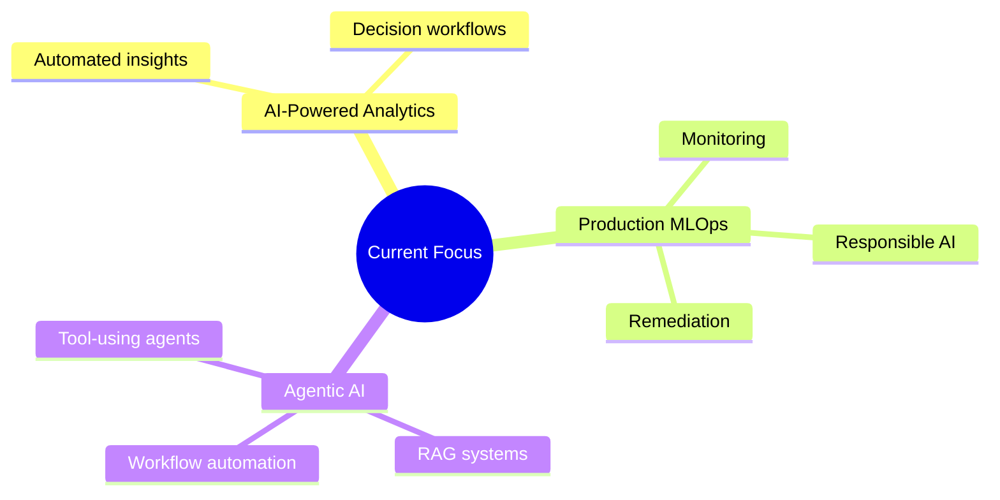

<div align="center">

<!-- Hero -->


<br />

<!-- Top Badge Bar -->
[](http://www.linkedin.com/in/jennisha-martin)
[](mailto:jennishamartin163@gmail.com)
[](https://github.com/jennisha29)
[](#)
[](https://github.com/jennisha29)

<br />


</div>

---

## 👋 Hello, I'm Jennisha

I'm a **Data Engineer**, **Data Analyst**, and **Applied AI Enthusiast** who loves building systems that make data useful, trustworthy, and actionable.

I design efficient **ETL/ELT pipelines**, develop **BI solutions**, and use modern cloud technologies to transform complex datasets into insights that help teams make better decisions.

```yaml
focus:
  - Scalable data pipelines
  - Cloud data platforms
  - Analytics engineering
  - Machine learning workflows
  - MLOps, RAG, and agentic AI systems
mission: "Build dependable data and AI solutions that create meaningful impact."
```

---

## 🛠️ What I Build

<details open>
  <summary><b>⚙️ Data Pipelines</b></summary>
  <br />
  Scalable ETL/ELT workflows for high-volume ingestion, transformation, orchestration, monitoring, and quality checks.
</details>

<details open>
  <summary><b>☁️ Cloud Data Platforms</b></summary>
  <br />
  Modern platforms using AWS, Snowflake, Spark, Airflow, Redshift, Databricks, and serverless services.
</details>

<details>
  <summary><b>📊 BI & Analytics Products</b></summary>
  <br />
  Dashboards, KPI reporting, dimensional models, executive analytics, predictive modeling, and business-ready data layers.
</details>

<details>
  <summary><b>🤖 Applied AI Systems</b></summary>
  <br />
  Machine learning, MLOps, NLP, RAG, LLM workflows, model evaluation, and AI-powered automation for real-world decision systems.
</details>

---

## 🚀 What Drives Me

I enjoy working across the data and AI stack, building solutions that turn ideas into practical outcomes. From reliable pipelines and cloud platforms to analytics products that support business decisions, I focus on systems that are both **scalable** and **useful**.

Over time, my work has expanded into **machine learning**, **MLOps**, **RAG systems**, and **agentic AI applications**. What I enjoy most is connecting the pieces: transforming raw data into insights, automating complex workflows, and building intelligent systems that solve real problems.

---

## 📌 Featured Projects

<div align="center">

| Project | Snapshot | Impact | Tech |
|---|---|---|---|
| 🤖 **AutoMend**<br /><sub>Autonomous MLOps Remediation Platform</sub> | Self-healing MLOps system that detects, diagnoses, and resolves ML incidents automatically | 🥉 3rd Place at Google Boston<br />⚡ Reduced incident response time by 40%<br />🧠 Integrated Airflow, Ray, DVC, Fairlearn, BERT, and Llama-3 | `Python` `Airflow` `Ray` `Polars` `Docker` `DVC` `BERT` `Llama-3` |
| 📦 **SupplyFlow**<br /><sub>Supply Chain Analytics Platform</sub> | End-to-end AWS platform for logistics and profitability analysis | ☁️ Built serverless ETL pipelines<br />🏗️ Designed snowflake-schema warehouse<br />📊 Delivered executive profitability dashboards | `AWS S3` `Lambda` `Glue` `Redshift` `PySpark` `Power BI` |
| 🏥 **HealthSync**<br /><sub>Healthcare Data Platform</sub> | Healthcare analytics pipeline using Medicare claims data | 🥈 Implemented medallion architecture<br />🔎 Found opioid overprescription patterns<br />🧾 Detected duplicate-claim patterns | `Python` `SQL` `dbt` `Snowflake` `AWS S3` `Looker Studio` |
| 📈 **TweetPulse**<br /><sub>Real-Time Social Media Analytics</sub> | Streaming analytics platform for Twitter engagement monitoring | ⚡ Automated real-time ingestion<br />💬 Added sentiment and trend monitoring<br />📊 Built near real-time dashboards | `Python` `Azure Blob` `EventGrid` `Snowpipe` `Snowflake` |

</div>

<details>
  <summary><b>🤖 Open AutoMend Details</b></summary>
  <br />
  Built a self-healing MLOps platform that detects, diagnoses, and resolves machine learning incidents automatically. The system integrates orchestration, distributed execution, model/version tracking, fairness checks, transformer-based diagnosis, and LLM-powered remediation.
</details>

<details>
  <summary><b>📦 Open SupplyFlow Details</b></summary>
  <br />
  Designed an end-to-end AWS analytics platform for logistics and profitability analysis, including serverless ingestion, warehouse modeling, and executive dashboards for carrier and profitability performance.
</details>

<details>
  <summary><b>🏥 Open HealthSync Details</b></summary>
  <br />
  Developed a healthcare analytics pipeline using Medicare claims data, Snowflake medallion architecture, dbt transformations, and dashboards for opioid overprescription and duplicate-claim insights.
</details>

<details>
  <summary><b>📈 Open TweetPulse Details</b></summary>
  <br />
  Built a near real-time Twitter analytics platform with automated ingestion, Snowflake loading, sentiment monitoring, trend detection, and business dashboards.
</details>

---

<a id="tech-stack"></a>

## ⚙️ Tech Stack

<div align="center">

### 💻 Programming Languages


### ⚡ Data Engineering


### ☁️ Cloud & DevOps


### 📊 BI & Analytics


### 🤖 AI / ML


</div>

---

## 🏆 Achievements

<div align="center">

| 🏅 Recognition | Details |
|---|---|
| 🥉 **3rd Place – Google Boston (2026)** | **AutoMend:** Autonomous MLOps Incident Remediation Platform |
| ⭐ **Infosys Rising Star Award (2023)** | Recognized for high-impact contributions and growth |
| 🏅 **Infosys Insta Award (2022)** | Recognized for strong delivery and performance |

</div>

---

## 🔭 Currently Exploring



---

## 📊 GitHub Pulse

<div align="center">


<br />


<br /><br />


</div>

---

## 🧭 How I Think About Data

```text
Raw Data
   ↓
Reliable Pipelines
   ↓
Analytics-Ready Models
   ↓
Clear Business Insights
   ↓
Smarter Decisions
   ↓
Scalable Impact
```

---

## 📫 Let's Connect

<div align="center">

### ✨ Let's build something useful, scalable, and a little bit brilliant.

<br />

[](http://www.linkedin.com/in/jennisha-martin)
[](mailto:jennishamartin163@gmail.com)

</div>

---

<div align="center">

### ✨ Thank you for visiting! 😊


</div>
